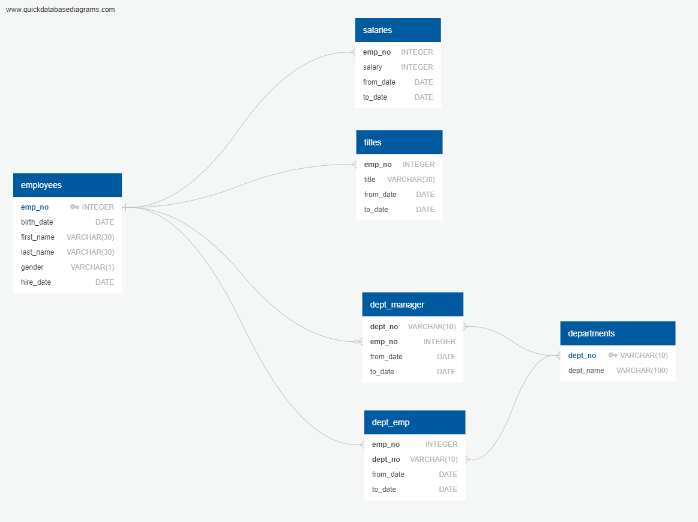

# SQL Challenge

Data model and analysis of an employee database that includes information about employees, such as name, hire date, and department, from a specific corporation from the 1980s and 1990s.

* [Overview](#overview)
* [Jupyter Notebook](#nb)
* [Technologies Used](#technologies)

##  <a name="overview"></a>Overview

This repository includes a data model and analysis of an employee database, which includes information about company employees, such as name, title, and start/end date, from a specific corporation from the 1980s and 1990s. The work for this project is split out into 3 different parts:

* [Data Modeling](#modeling)
* [Data Engineering](#engineering)
* [Data Analysis](#analysis)

### <a name="modeling"></a>Data Modeling

The first step I took in modeling and analyzing the data was inspect the various csv files and sketch out an ERD (entity relationship diagram) of the tables. To create the ERD, I used a tool called [Quick DBD](https://www.quickdatabasediagrams.com/).



After creating the ERD, here are some of my observations and insights for how the different tables are related to each other:

* For the dept_emp and employees tables, an employee can belong to one or many departments. So, this is a one or many (dept_emp) to one (employees) relationship. In the dept_emp table, emp_no is a foreign key that references the employees table.
* For the department and dept_emp tables, dept_emp can belong to one or many departments, and a department can have one or many dept_emp. So, this is a many (department) to many (dept_emp) relationship.
In the dept_emp table, dept_no is a foreign key that references the departments table.
* For the dept_manager and department tables, dept_manager can belong to one or many departments, and a department can have one or many dept_manager. So, this is a many (department) to many(dept_manager)relationship. In the dept_manager table, dept_no is a foreign key that references the departments table.
* For the dept_manager and employees tables, employee can be dept_manager of zero, one, or many departments or be dept_manager of different departments over time. So, this is a zero or many (dept_manager) to one (employees) relationship. In the dept_manager table, emp_no is a foreign key that references the employees table.
* For the salaries and employee tables, an employee can have one or many salary numbers over time. So, this is a one or many (salaries) to one (employees) relationship. In the salaries table, emp_no is a foreign key that references the employees table.
* For the titles and employee tables, an employee can have one or many titles. So, this is a one or many (titles) to one (employee) relationship. In the titles table, emp_no is a foreign key that references the employees table.
* In the employees table, emp_no is a primary key.
* In the departments table, dept_no is a primary key.

### <a name="engineering"></a>Data Engineering

I started with 6 csv files, which are located [here](./data). These files include various information about each employee, such as name, hire date, what department each employee belongs to, and salary information. With these files, I created a SQL table schema for each csv, defining the data types, primary keys, foreign keys, and other constraints. I then used the schema to import each csv file into the appropriate SQL table. The .sql file that includes the table schema is located [here](./schema.sql).

Note: If you try to run the **schema.sql** file to import the csvs, you might have to update the csv path to the location of the csv files on your system. The **schema.sql** file assumes the csv files are located in **C:\data**.

### <a name="analysis"></a>Data Analysis

After creating the schema and importing the data into the appropriate tables to get the database setup, I worked on analzying the employee data using SQL queries to join and query the various tables. The analysis includes various sql queries, which are located [here](./query.sql). These queries do the following:

* List the following details of each employee: employee number, last name, first name, gender, and salary.
* List employees who were hired in 1986.
* List the manager of each department with the following information: department number, department name, the manager's employee number, last name, first name, and start and end employment dates.
* List the department of each employee with the following information: employee number, last name, first name, and department name.
* List all employees whose first name is "Hercules" and last names begin with "B."
* List all employees in the Sales department, including their employee number, last name, first name, and department name.
* List all employees in the Sales and Development departments, including their employee number, last name, first name, and department name.
* In descending order, list the frequency count of employee last names, i.e., how many employees share each last name.

### <a name="nb"></a>Jupyter Notebook

In this repository, I have also included a [jupyter notebook](./employee_analysis.ipynb) file. In this file, I imported the tables from the sql database into pandas. After importing the database, I used matplotlib to create a histogram that visualizes the most common salary ranges for employees and a bar chart that shows the average salary by job title. Images of these visulizations can be found [here](./Images).

Before you run the jupyter notebook, you will need to do the following:

* Install **psycopg2** in the anaconda environment.
* Create a **config.py** file in the same directory as the jupyter notebook. Then, update the file to include your postgresql username and password, as shown in the following example:

  ```bash
  username = "postgres"
  password = "<your PostgreSQL password>"
  ```

##  <a name="technologies"></a>Technologies Used

* SQL
* Quick DBD
* Jupyter Notebook
* Python
* Matplotlib
* Pandas
* SQLAlchemy
